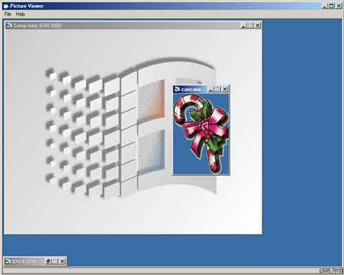



## Picture/Graphic Viewer

### Description

To view more than one image simultaneously so that you don't have a heap of images loaded in your taskbar like IE does for me.
 
### More Info
 
Read the help!

             |
---                |---
**Submitted On**   |2000-12-21 10:58:52
**By**             |[Vlad Stanculescu](https://github.com/Planet-Source-Code/PSCIndex/blob/master/ByAuthor/vlad-stanculescu.md)
**Level**          |Beginner
**User Rating**    |4.0 (8 globes from 2 users)
**Compatibility**  |VB 4\.0 \(16\-bit\), VB 4\.0 \(32\-bit\), VB 5\.0, VB 6\.0
**Category**       |[Complete Applications](https://github.com/Planet-Source-Code/PSCIndex/blob/master/ByCategory/complete-applications__1-27.md)
**World**          |[Visual Basic](https://github.com/Planet-Source-Code/PSCIndex/blob/master/ByWorld/visual-basic.md)
**Archive File**   |[CODE\_UPLOAD1288512202000\.zip](https://github.com/Planet-Source-Code/vlad-stanculescu-picture-graphic-viewer__1-13743/archive/master.zip)

